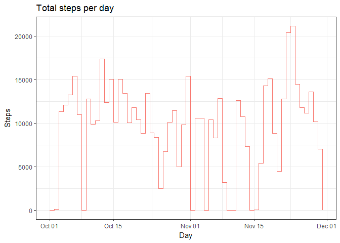
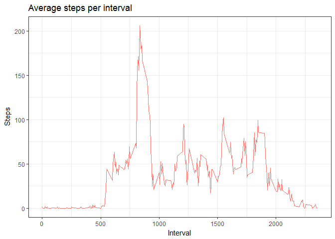
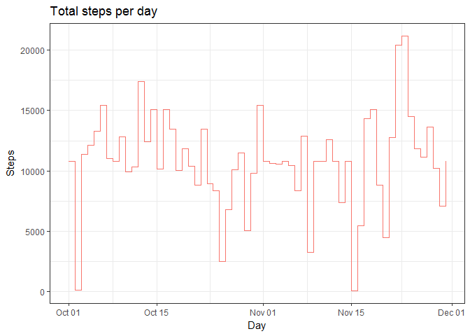
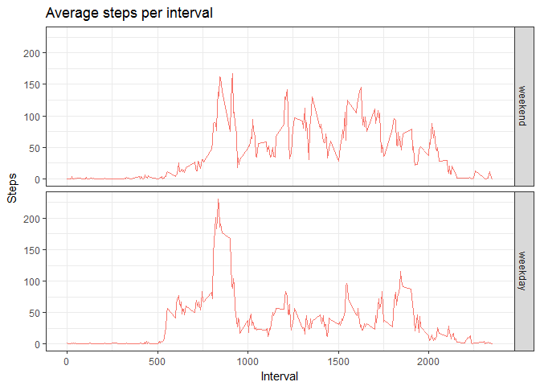

# C5W2 Project
Medhat Farag  
August 19, 2017  


## Purpose

This is an R Markdown document. It is written as an assignment for reproducible research course at JHU on coursera. This assignment is intended to train students on usage of R markdown & Knitter.

This assignment makes use of data from a personal activity monitoring device. This device collects data at 5 minute intervals through out the day. The data consists of two months of data from an anonymous individual collected during the months of October and November, 2012 and include the number of steps taken in 5 minute intervals each day.

- The start will be reading the data set as it is the first requirement of the assignment


```r
setwd("~/R Directory/C5W2")
db <- read.csv("activity.csv")
```

- The second requirment is to do a histogram of the total number of steps taken each day.


```r
db$date <- as.Date(db$date)
sum_steps <- tapply(db$steps, db$date, sum, na.rm = TRUE)
library(ggplot2); library(dplyr)
qplot(unique(db$date), sum_steps, col = "red", ylab = "Steps", xlab = "Day", main = "Total steps per day", geom = "step") + theme_bw() + theme(legend.position = "none")
```

<!-- -->

- Third requirement is to Calculate the mean and median of the total number of steps taken per day


```r
mean(sum_steps)
```

```
## [1] 9354.23
```

```r
median(sum_steps)
```

```
## [1] 10395
```

- Fourth requirement is to plot a time series of the average number of steps taken per each 5-minute period


```r
av_steps <- tapply(db$steps, db$interval, mean, na.rm = TRUE)
qplot(unique(db$interval), av_steps, col = "red", ylab = "Steps", xlab = "Interval", main = "Average steps per interval", geom = "line") + theme_bw() + theme(legend.position = "none")
```

<!-- -->

- Fifth requirement is to find the 5-minute interval that, on average, contains the maximum number of steps


```r
unique(db$interval)[which.max(av_steps)]
```

```
## [1] 835
```

- The total number of missing observations is calculated, then these missing values are substituted by average of same interval across all other days rounding to nearest integer to eliminate fractions in number of steps. This is the sixth requirement.


```r
sum(is.na(db$steps))
```

```
## [1] 2304
```

```r
db <- db %>% group_by(interval) %>% mutate(int_av = mean(steps, na.rm = TRUE))
db$steps[is.na(db$steps)] <- round(db$int_av[is.na(db$steps)])
sum(is.na(db$steps))
```

```
## [1] 0
```

- The seventh requirment is to replot the histogram of the total number of steps taken each day & recalculate the mean and median.


```r
sum_steps <- tapply(db$steps, db$date, sum, na.rm = TRUE)
qplot(unique(db$date), sum_steps, col = "red", ylab = "Steps", xlab = "Day", main = "Total steps per day", geom = "step") + theme_bw() + theme(legend.position = "none")
```

<!-- -->

```r
mean(sum_steps)
```

```
## [1] 10765.64
```

```r
median(sum_steps)
```

```
## [1] 10762
```

- The eighth requirement is to do a panel plot comparing the average number of steps taken per 5-minute interval across weekdays and weekends


```r
db$dayclass <- weekdays(db$date) != "Saturday" & weekdays(db$date) != "Sunday"
db$dayclass <- factor(db$dayclass, labels = c("weekend", "weekday"))
db <- db %>% group_by(dayclass, interval) %>% mutate(int_av = mean(steps, na.rm = TRUE))
qplot(data = db, x = interval, y = int_av, facets = dayclass ~ ., geom = "line", xlab = "Interval", ylab = "Steps", main = "Average steps per interval", col = "red") + theme_bw() + theme(legend.position = "none")
```

<!-- -->
